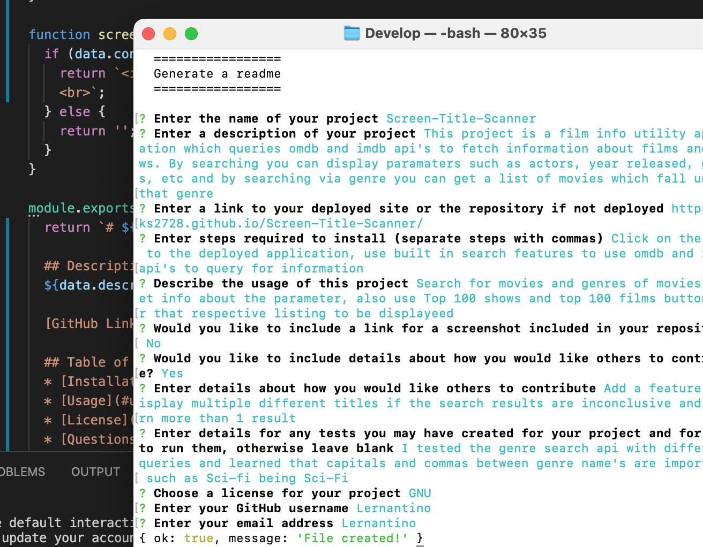

# Screen Title Scanner  

  ## Description  
  This project is used to display info about films or shows by fetching data from imdb and omdb api. The app also allows searches by genre(s) where a list is displayed.  
  
  [GitHub Link](https://github.com/yks2728/Screen-Title-Scanner) 

  ## Table of Contents
  * [Installation](#installation)
  * [Usage](#usage)
  * [License](#license)
  * [Questions](#questions)
 
  ## Installation
  X Visit the repository page X Click the link to the deployed application X Use the search functionality to browse films and shows
  
  ## Usage
  Users are able to search by film name or by genre(s) name to get info about a film or multiple films in a list, also the users searches get stored to buttons where they can be recalled. Extra features include Top 100 shows and top 100 films buttons  
   
  </img>  
     
  ### Contributing info: Add a feature to narrow down searches which return multiple results   
  ### Tests info: Tests created for the genre search bar to narrow down and format the search string with capitals and commas, and to capitalize sci-fi to Sci-Fi for example, which is important formatting   
  ## License 
   
  MIT: A short and simple permissive license with conditions only requiring preservation of copyright and license notices. Licensed works, modifications, and larger works may be distributed under different terms and without source code. 
   
  https://choosealicense.com/licenses/mit/ 
  
  ## Questions  
  GitHub username: yks2728   
  Email me with any other questions: gregoryjohncarter@gmail.com 